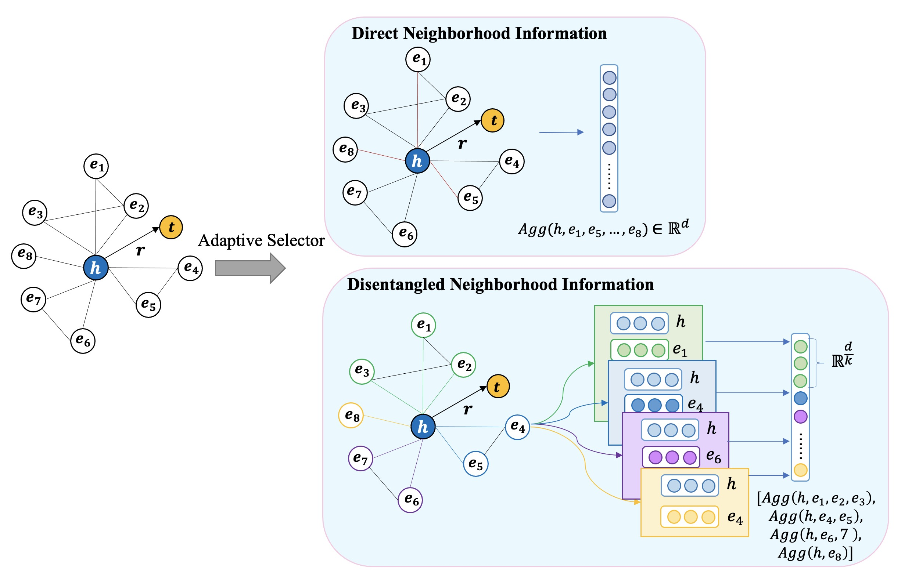

<h4 align="center">DDNAN: Knowledge Graph Embedding with 
Direct and Disentangled Neighborhood
Representation Attention Network</h4>

<h2 align="center">
  Architecture of DDNAN
  
</h2>

This is our PyTorch implementation for the paper DDNAN. (Current implementation is not complete, it will be updated in the future)

### Training model:

- Fitst checkout dependencies installation in `requirements.txt.`

- pytorch=1.8, python=3.7

- `sh ./preprocess.sh` for preprocessing the dataset and setting up for experiments.

- Commands for reproducing the reported results on link prediction:
  
  ```shell
  ##### For training and test:
  python run.py -epoch 1500 -name ConvE_FB15k-237_M20_K4_D200
  ```

## Acknowledgement

The project is built upon [DisenGCN](https://github.com/JianxinMa/jianxinma.github.io/tree/master/assets)

Please create an issue or send an email to contact use.
